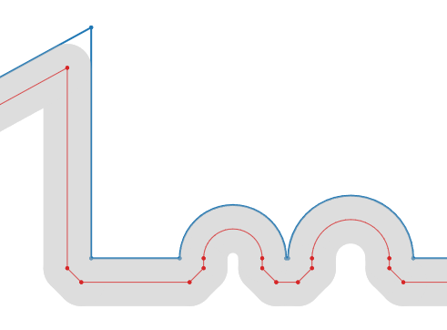
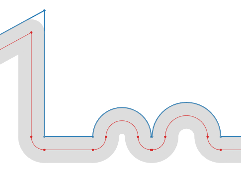
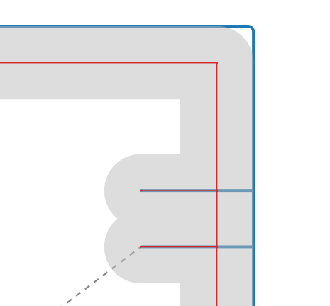

# Cutter_Comp_XY
⚠️ Safety Notice

This is hobby-grade experimental code developed for personal CNC equipment.
It has not been validated for safety-critical use.
Running motion-control software can damage machines or cause injury if used
incorrectly. Review the code and test carefully before using it on real hardware.

2D cutter compensation engine for XY toolpaths with both Arduino-target and desktop-host execution paths.

## Current Feature Set
- Cutter compensation modes: `G41` (left), `G42` (right), `G40` (cancel).
- Motion support: `G0`, `G1`, `G2`, `G3` in XY (`G17`).
- Coordinate modes: `G90` absolute and `G91` incremental.
- Arc input formats: `I/J` incremental center offsets and `R`-based arc definition.
- Planar and helical full-circle arcs using I/J centers and explicit XYZ words.
- Positive-integer `P` turn counts on `G2`/`G3` in the C++ and C# runners, with multi-turn support through the MCU grblHAL adapter.
- Comment stripping support for both `;` and `( ... )` comments.
- Corner rolling / bevel-style transition behavior.
- Optional global self-intersection trimming and geometry cleanup pass.
- Configurable look ahead for gouge detection and buffer sizing.
- +- offset values supported for wear compensation.
- Incremental/Absolute support.
- Z-only moves are preserved; helical arcs retain Z travel, interpolated over total angular travel when expanded into turns or half-circles.
- Global self intersections are ignored when Z does not match between pairwise comparisons to allow for thread milling.

## Project Layout
- `src/` - C++ parser/runtime headers and embedded entry (`cc_simple_scan.h`, `cc_processor.h`, `cc_main.h`, `main.cpp`).
- `mcu/` - C99 core engine and grblHAL adapter (`cutter_comp.c`, `cutter_comp.h`, `cutter_comp_grblhal.h`).
- `host/` - Desktop harness (`main_host.cpp`) and visualization/report writers (`writer.h`).
- `csharp/CutterCompXY.Port/` - .NET 8 C# parity/port executable.
- `data/` - Sample NC programs used by the host harness.
- `output/` - Generated host outputs (`.nc/.ngc`, `.host.svg`, `.mcu.svg`, `.compare.txt`).
- `build/` - CMake/Visual Studio build output (generated).
- `platformio.ini` - PlatformIO embedded environments.

## Host Workflow (Recommended for development)
1. Build `cc_runner` with the VS Code CMake task (`CMake: build`).
2. Run the executable from the CMake build output (or launch via your IDE profile).
3. Input/output behavior:
	 - With no CLI args, or with `all` as the first argument, the host runs the default file list configured in `host/main_host.cpp`.
	 - You can pass args: `cc_runner [inputfile|all] [outputfolder] [toolradius] [roll|chamfer] [svg|nosvg]`.
	 - Default input/output paths are relative to the working directory: `../../data/` and `../../output/`, intended for execution from `build/Debug/`. A single-file invocation can instead supply explicit paths.
	 - A zero or omitted tool-radius override uses half the input D diameter at compensation entry.
4. Generated outputs in `output/`:
	 - `<input>.<ext>` - compensated toolpath G-code (keeps input extension when present)
	 - `<input>.host.svg` - compensated vs original overlay
	 - `<input>.mcu.svg` - MCU core profile visualization through the grblHAL host shim
	 - `<input>.compare.txt` - comparison report between full runner and standalone `cc_xy`

SVG paths use non-scaling strokes: 1 px normally and 2 px for emphasized MCU paths, independent of geometry size or SVG viewport scaling. Rapid dash lengths and marker outlines are also screen-space sizes. Tool-circle radii and tool-sweep widths remain in geometry units to show the actual tool diameter. Regenerate existing SVGs after rebuilding to apply this styling.

SVG titles display the tool diameter as `tool dia.` (twice the absolute tool radius). The runner's tool-size argument remains a radius.

SVGs are XY projections, not verification of helical Z travel. The current SVG arc sampler treats coincident start/end points as zero sweep, so unsplit full circles can disappear from host or original-path plots. It also does not visualize additional P turns. MCU-emitted full circles are split into half-circles and can therefore look correct even when the host plot omits a complete turn. Check generated G-code and controller arc semantics rather than relying on the plots alone.

The C++ host and MCU use a physical equality/proximity tolerance of 0.0001 mm (0.0001 / 25.4 in in G20 mode), separately from the angular endpoint tolerance of 8 times `FLT_EPSILON` radians. Unit-vector and segment-parameter thresholds do not scale with program units. The C++ helpers share the active unit setting, like the existing arc/gap tolerances; interleaved or concurrent engines with different units are not supported.

Comparison reports use a 0.005 mm XY tolerance and bounded geometric alignment (up to 16 skipped segments) instead of pairing every move by index. Inserted, missing, and trailing moves are explicitly reported as unmatched and counted as mismatches; they are not discarded. Center/radius deltas are calculated only for arc-to-arc pairs, and opposite arc directions are mismatches. Profiles are still compared in XY only; changing-Z moves are excluded. The `cc_runner_modal` CTest covers physical/angular tolerance boundaries in both units, inserted and removed connectors, genuine geometry differences, trailing moves, arc direction, and preservation of the small arc-to-line connector in `TortureTestSmallFilletsG91.nc`.

The `cc_host_crossings` CTest covers short-segment membership and trimming crossing roll arcs in inch and millimeter coordinates, plus circle tangency, separation, containment, coincident centers, and signed radii. The host circle-intersection calculation uses the same scale-aware linear tangency and squared roundoff tolerances as the MCU core.

Both the host and MCU reject arcs whose start/end radius difference exceeds 0.0005 in (0.0127 mm). A radius error stops processing; the CLI exits nonzero and reports that generated outputs are incomplete. Previously emitted motion may remain in the diagnostic G-code/SVG outputs, and host/MCU lookahead can leave different-length partial profiles. `TortureTestG90LARGE.nc` has corrected I/J centers at N15, N39, N44, N57, N60 and N62 to equalize start/end radii while preserving programmed endpoints. The `cc_host_crossings` CTest also checks accepted and rejected radius mismatches, failure latching, and runner rejection in both units with crossing trimming enabled and disabled.

With crossing lookahead disabled, both the host and MCU check both adjoining lines for reversal immediately after resolving a corner, before emitting the preceding line or corner inserts. An inversion reports the reversed move's source line and stops processing, even if a later corner could extend that line back into its original direction. Crossing lookahead retains its existing deferred cleanup behavior. The `cc_host_crossings` and `cc_junction_recovery` CTests cover early rejection, source-line attribution, and enabled-lookahead behavior.

With crossing lookahead disabled, an unresolved line-line corner is also rejected rather than bridged with a fallback bevel. The host and MCU stop before emitting the preceding line and the unresolved connector. The `cc_host_crossings` CTest covers the short zigzag from `G41_1.nc`; its SVGs are generated from the partial emitted paths, not from rejected moves.

At compensation cancellation, the C++ and C# runners restore the input motion mode with a standalone `G0`/`G1`/`G2`/`G3` block only if it differs from the last emitted motion mode. This keeps subsequent unmodified modal lines (including Z-only retracts) from inheriting a compensated arc mode when the cancel move is omitted. The `cc_runner_modal` CTest covers mode restoration, unchanged post-comp lines, matching modes, emitted cancel moves, runner reuse, absolute/incremental coordinates, and status comments and crossing trimming enabled/disabled.

Input examples are provided under `data/` (`G41_1.nc`, `G42_1.nc`, `TortureTestG90.nc`, `TortureTestG91.nc`, etc.).

The default host test-file list includes `TortureTestG90LARGE2X.nc`, a twice-size copy of `TortureTestG90LARGE.nc`. All XYZ coordinates, I/J arc offsets, and the D tool diameter are doubled; feeds, units, motion modes, and move count are unchanged. After scaling, I/J centers at N31, N40, N49, N53, N54, and N58 are minimally adjusted to bring start/end radius discrepancies within the fixed arc tolerance without changing endpoints. All numeric words use at most four decimal places.

The normal runner also visualizes the MCU path without flashing a board. Run `cc_runner data/Sample3.nc output 0.065` from the repository root after building `cc_runner`; it writes `output/Sample3.mcu.svg` alongside the host SVG and comparison report. The radius argument follows the program's units at compensation entry (0.065 in = 1.651 mm for G20). The MCU core always receives mm; G20 motion coordinates, I/J, R, Z, and feed are converted by the host scanner. This tests the MCU compensation core and grblHAL shim, not the firmware G-code parser or motion planner.

## Full Circles, Helices, and Arc Turns
- For `G2`/`G3`, omitted P means one turn. A positive integer P requests P - 1 complete circles followed by the arc to the programmed endpoint. If that endpoint equals the start, the final arc is another complete circle.
- For example, `G3 X0 Y1 Z-0.4 I-1 J0 P3`, starting at X1 Y0 Z-0.1, makes two complete CCW circles followed by a quarter-circle. Z is distributed over the entire 2.25 revolutions, not applied once per circle.
- The C++ runner expands compensated multi-turn arcs into individual turns. The MCU API and C# runner split full circles into two half-circles, including midpoint Z interpolation. The grblHAL adapter accepts signed turn counts: positive for CCW, negative for CW.
- Compensated multi-turn arcs are rejected on G41/G42/G40 entry or exit moves by the C++ and C# runners. The MCU API and C# runner also reject full-circle entry/exit moves. Use separate line lead-in and lead-out moves.
- Arc merging does not combine opposite directions, changing-Z arcs, or arcs whose combined travel reaches a complete revolution.
- Outside compensation, the runners retain raw input blocks; they do not expand P arcs into separate output blocks.
- The host and C# scanners currently require an XYZ word to recognize an arc. I/J-only full-circle blocks without XYZ are not supported; supply explicit endpoint coordinates (or a Z endpoint for a helix). R cannot uniquely specify a full-circle center; use I/J.
- Arc P validation is intended for positive integers, but upper-bound and nonfinite checks before integer conversion are not yet complete. Very large or nonfinite P values are not supported test inputs.
- `cc_runner_modal` covers P3 helical Z distribution, P40 buffer handling, fractional-P rejection, and merge/trim combinations. `cc_junction_recovery` covers MCU planar/helical full circles, both directions, lookahead on/off, full-circle entry rejection, same-circle continuation, and tiny corner connectors. C# turn behavior has been checked manually; there is no persistent C# automated test project.

## Arduino / PlatformIO
- Configured environments are defined in `platformio.ini`:
	- `due`
	- `adafruit_grandcentral_m4`
- Embedded entry point is `src/main.cpp`.

## C# Port
- Project: `csharp/CutterCompXY.Port/CutterCompXY.Port.csproj`.
- Build from VS Code task: `dotnet: build`.
- Target framework: .NET 8 (`net8.0`).

## Integration API
- High-level runtime wrapper: `CcMainRunner` in `src/cc_main.h`.
- Runtime options are provided through `CcMainOptions` in `src/cc_processor.h`:
	- `toolRadius`
	- `cornerTreatment`
	- `globalTrimCrossing`
	- `globalMerge`
	- `emitStatusComments`
- Callback signatures:
	- `CcOutputCB(const char *text, size_t len)`
	- `CcErrorCB(const char *message, CompError err, uint32_t lineNum)`
- `CcMainOptions::CcMainCallbacks` currently contains `output` and `error` callbacks only (no `userData`).

## Notes and Scope
- This project focuses on 2D XY compensation behavior and geometry handling.
- The host harness is for algorithm validation and visualization; it is not a machine controller.

## 1. Full Tool Radius / Diameter Compensation ("Control" or "In Control" comp)

Tool offset table → Enter the full tool radius (or full diameter, depending on control parameter setting).
CAM post → Outputs toolpath at part geometry (centerline of feature), then adds G41/G42.
Machine → Offsets the path by the full amount in the offset table.
Pros — Simple if you always measure and enter the exact tool size.
Cons — Lead-in/lead-out moves must be longer than the tool radius (to avoid alarms/interference). Changing tools requires updating the full value. Small adjustments (e.g., 0.0005" for size tweaking) can cause unexpected over/under-cutting if not careful.

## 2. Wear Compensation (Most popular in modern shops with CAM)

Tool offset table → Enter 0 (or very close to the nominal tool radius/diameter) in the geometry/radius column.
CAM post → Outputs toolpath offset by the nominal tool radius (tool centerline path), still with G41/G42.
Machine → The offset value (wear column or sometimes the same D register) adds/subtracts a small deviation.
Positive wear → Tool moves away from part (less material removed, bigger part).
Negative wear → Tool moves toward part (more material removed, smaller part).

## Corner Treatment
Corners can be a arc roll or a chamfer style.

Internal corners are consumed if needed.

## License
MIT
